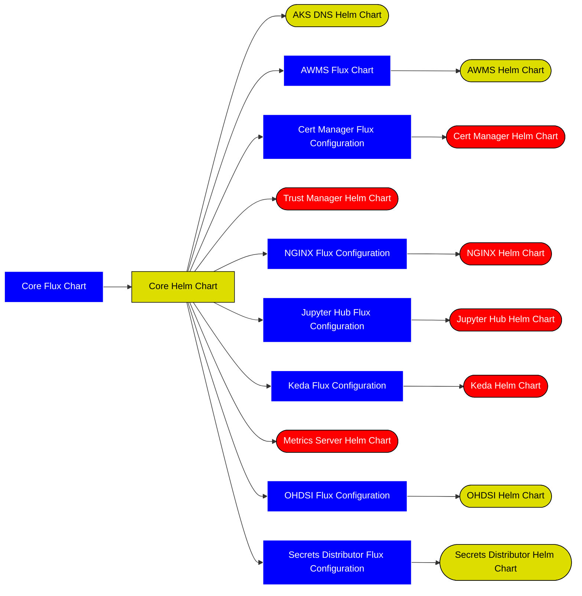

# iac-flux-lscsde
Flux Configuration for LSC SDE Components

## Developer Guide
In a AKS environment this is the only flux configuration that is added to the system, this in turn calls the [Core LSCSDE Helm Chart](https://github.com/lsc-sde/iac-helm-lscsde-flux) which will in turn install the relevant components.

Originally this was pointing at other flux charts for [configuration](https://github.com/lsc-sde/iac-flux-lscsde-configuration) and [components](https://github.com/lsc-sde/iac-flux-lscsde-components) however flux is not suitable for flow control and so we cannot use it for feature toggling, hence it was replaced with a helm chart.

When the main branch of this repository is created it will trigger a github action which will:
* Calculate a semver version number
* Create a release branch with the semver version
* Update the submodules on the main repository

This will in turn trigger github actions that will propagate those changes up the chain



### Environmental Branches
The following branches are environmental:

| branch name | environment |
| --- | --- |
| prod | Production |
| dev | Development |
| main | Sandbox / Local |

when we want to release to an environment we will do a pull request from the latest release branch into the relevant environment branch

This will effectively update the references to the release branch on each of the apps and versions for the various helm charts. This means that if we need to patch an issue in a production release for a specific component we can identify the branch in question, we can then create a branch from the relevant release branch, fix the issue, test on environments and then raise a pull request into the release version branch, then merge in those changes into the production environment.

## Setting up a local environment
### microk8s Installation
To install locally it is best to use microk8s which can be installed using the following command:

```bash
sudo snap install microk8s
```

Once installed you can setup the required add-ons:

```bash
microk8s enable dns hostpath-storage rbac metallb
```

you will be asked for an IP address range for the service to hand out for the load balancers used by nginx etc, in my instance I used **10.64.140.43-10.64.140.49** however you can use a different range if necessary.

Once all the addon's are installed, you can also setup your local kubectl to work with microk8s (this will overwrite the existing kube config):

```bash
microk8s config > ~/.kube/config
```

### FluxCD Installation

After this, you will need to install the flux CLI:
```bash
curl -s https://fluxcd.io/install.sh | sudo FLUX_VERSION=2.0.0 bash
```

Once the flux CLI is installed, you can then install flux onto the microk8s cluster
```bash
flux install
```

### Secrets
Once installed you will need to install secrets into a folder on your developer machine at the following path:
```
/run/desktop/mnt/host/c/tmp/secrets
```

The secrets should be presented as a file per entry with the name, file names are case sensitive.

| Name | What it does |
| --- | --- |
| HadesPassword | Password for the OHDSI Hades system |
| JupyterAppRegistrationClientSecret | The client secret for the app registration used by Jupyterhub |
| OhdsiAppRegistrationClientSecret | The client secret for the app registration used by OHDSI |
| OhdsiDbPassword | The postgresql database server password used to access the OHDSI database |
| JupyterCookieSecret | A 32 byte hex string representing the secret used to encrypt jupyter cookies |
| WildcardCertificate  | The wildcard certificate used for TLS |
| WildcardCertificateKey | The wildcard certificate key used for TLS |
| PrimaryStorageAccountName | The primary storage account name used in azure for storage claims, this can be blank in a local environment |
| PrimaryStorageAccountKey | The primary storage account key used by azure for storage claims, this can be blank in a local environment |
| SqlAdministratorLogin  | The SQL Administrator username, this can be blank in a local environment |
| SqlAdministratorPassword | The SQL Administrator password, this can be blank in a local environment |
| SqlHostName | The SQL Host name, this can be blank in a local environment |
| PatToken | The Personal Access Token used by the github-runners, this can be blank in a local environment |


### OHDSI Database (PostgreSql)
You will also need to install or use an existing a postgresql server and setup the ohdsi database. We recommend installing this from scripts in the [Broadsea Atlas DB](https://github.com/OHDSI/Broadsea-Atlasdb/) implementation.

This should be configured to allow connections from the hosts, the /etc/hosts file should be updated to add a record for **cluster.lsc-sde.local** that points at the postgres server.

```
192.168.0.44 cluster.lsc-sde.local # the postgres server
```

This will require a user called **ohdsi@cluster.lsc-sde.local** with permissions to make changes to the ohdsi database

### Configure Flux for LSCSDE
```bash
kubectl create namespace lscsde
kubectl create namespace lscsde-config
flux create source git lscsde --url="https://github.com/lsc-sde/iac-flux-lscsde" --branch=main --namespace=lscsde
flux create kustomization lscsde-cluster-config --source="GitRepository/lscsde" --namespace=lscsde --path="./clusters/local" --interval=1m --prune=true --health-check-timeout=10m --wait=false
```

This should in turn deploy all of the resulting resources on your local cluster.

This will take a few minutes to provision everything, but should largely take care of itself. 

### /etc/hosts file
Once completed you will need to update your /etc/hosts file to include the lsc-sde.local entries:

```
10.64.140.34 ohdsi.lsc-sde.local # nginx load balancer
10.64.140.34 jupyter.lsc-sde.local # nginx load balancer
192.168.0.44 cluster.lsc-sde.local # the postgres server
```

